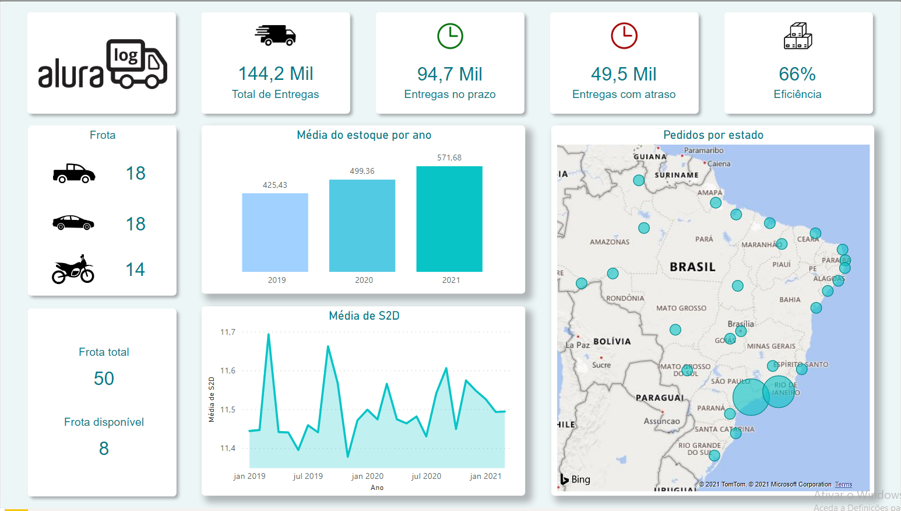

<h1> Alura Challenge de BI </h1>
<h2> Semana 01: Desafio de logística - Alura Log </h2>

A pessoa que gerencia a área de logística da Alura Log, está enfrentando algumas mudanças em sua área por conta do aumento da demanda dos serviços de logística no período da pandemia. Ela quer manter a qualidade de seu serviço, mas para isso precisa acompanhar constantemente as métricas do seu departamento para tomar as melhores decisões. Para auxiliar nesse desafio criei um dashboard para logística com algumas métricas muito importantes para a área.

<h3> Base de Dados </h3>

A base de dados fornecida pela Alura log apresenta os seguintes arquivos .csv. 

<ul>
  <li> <b> tabela pedidos </b> - contém o registro de todos os pedidos feitos pelos clientes; 
    

    <ul>
      <li> Data do pedido </li>
      <li> Data de entrega </li>
      <li> Data previsão de entrega </li>
      <li> ID pedido </li>
      <li> Latitude </li>
      <li> Longitude </li>
      <li> UF de entrega </li>
      <li> ID do produto</li>
      <li> Quantidade </li>
      <li> ID veículo </li>
    </ul>
  </li>
  

  <li> <b> tabela produtos </b> - contém os produtos cadastrados e seus valores; 
    

    <ul>
      <li> ID produto </li>
      <li> Categoria produto </li>
      <li> Valor </li>
    </ul>
  </li>
  

  <li> <b> tabela veículos </b> - contém veículos registrados que fazem o transporte dos produtos; </li>
    

     <ul>
      <li> ID produto </li>
      <li> Data atualização </li>
      <li> Quantidade </li>
    </ul>
  

  <li> <b> tabela estoque </b> - contém o registro de estoque dos produtos por mês. </li>
    

    <ul>
      <li> ID veículo </li>
      <li> Tipo </li>
      <li> Status </li>
    </ul>
</ul>

<h3> Métricas </h3>

<ul>
  <li> Entregas no prazo </li>
  <li> Entregas atrasadas </li>
  <li> Veículos disponíveis para entrega </li>
  <li> S2D - Ship to door </li>
  <li> Índice de ocorrências por estado </li>
  <li> Média do estoque </li>
  <li> Estoque disponível por Categoria </li>
</ul>

<h3> Dashboard </h3>

<h4> Aba Geral </h4>

  

<h3> Link do Dashboard </h3>
https://app.powerbi.com/groups/me/reports/1fee4adf-6a11-416b-84d2-ee6151dea11d?ctid=11e71783-c2ea-4fee-8318-7122f18d7534&pbi_source=linkShare

